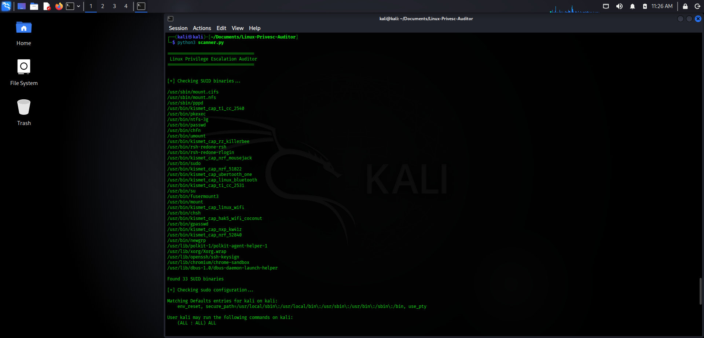

# Linux Privilege Escalation Auditor

A Python-based Linux security auditing tool that identifies common privilege escalation vectors and security misconfigurations.

## Features

* SUID binary enumeration
* Sudo privilege analysis
* World-writable file detection
* Security summary generation
* HTML report generation

## Usage

```bash
python3 scanner.py
```

## Example Output

Found 33 SUID binaries

[LOW] No dangerous sudo configuration found

Found 0 world-writable files

## Demo



## Disclaimer

This tool is intended for educational purposes and authorized security assessments only.
